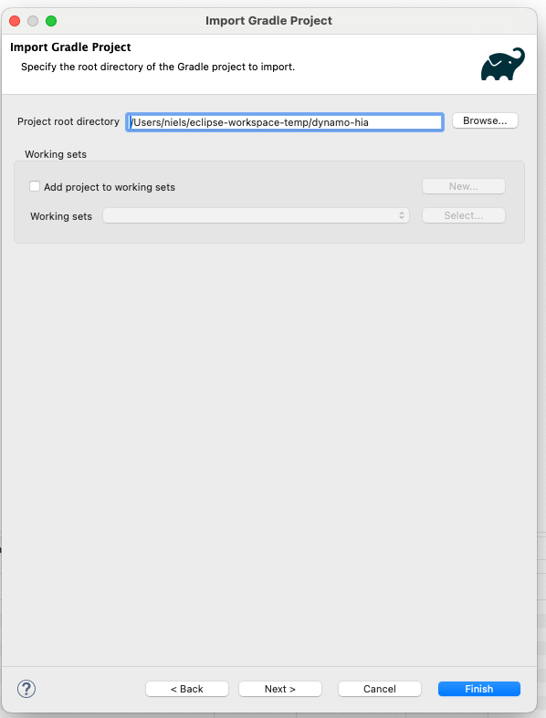

# Developing DYNAMO-HIA using Eclipse

This is a small guide on how to get started with developing Dynamo-HIA in [Eclipse](https://eclipseide.org).

The obvious (but unfortunately non-functional) way to create a project would be to use import and fetch the project from GitHub in a single step. Instead we will first clone the repository to our workspace, and import it from there.

- Download and install the Eclipse-IDE. Any recent version should do. Ensure the package you download includes the Gradle and Git integrations (e.g. the Eclipse IDE for Java Developers).

- Use the Git repository view to clone the repository from GitHub, and clone it to your workspace. Note that the default location for the clone is outside of your workspace.

- Use "Import exiting Gradle Project" under File -> Import to import the project.

- To test the setup, running the Main class under Frontend -> Src/main/java -> nl.rivm.emi.dynamo.ui.main.main.Main should start the Dynamo-HIA application.

